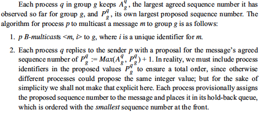
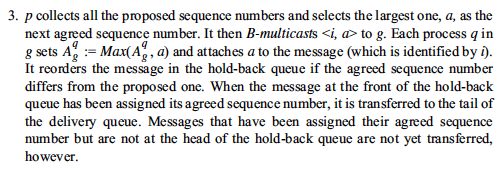
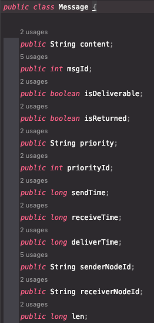
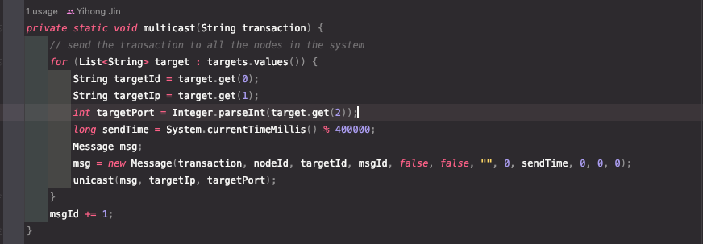
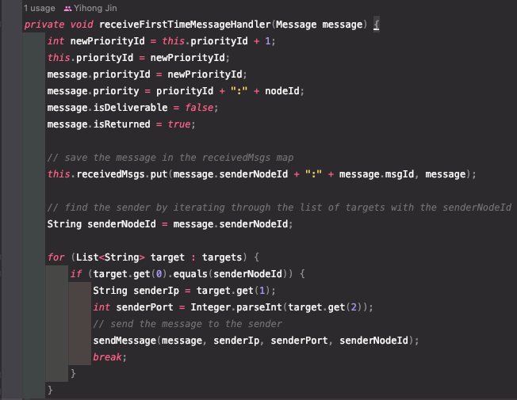
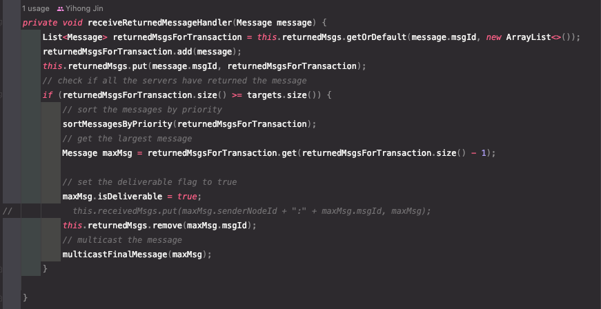
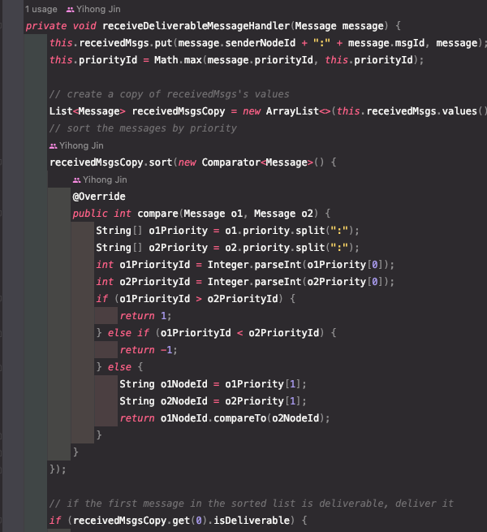
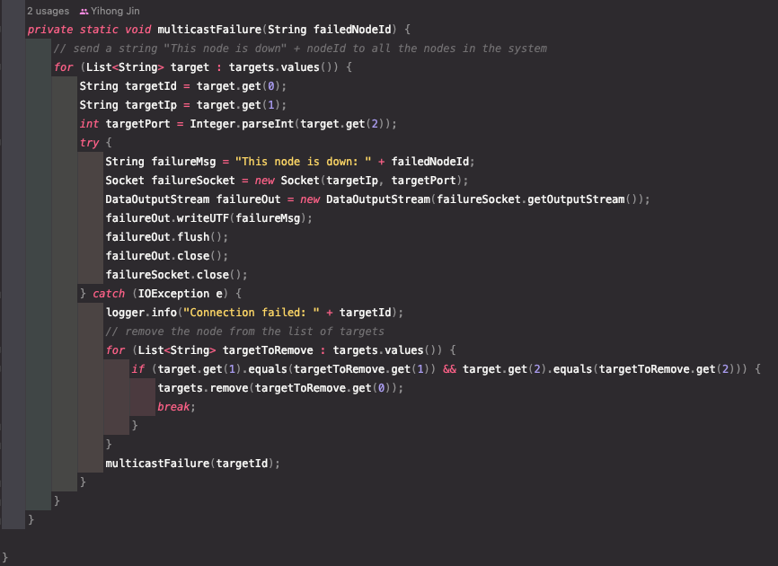
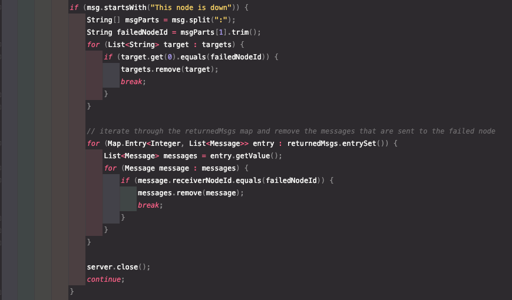

# Distributed Transactions

**Group Members:**

Name: Yihong Jin
NetID: yihongj3

Name: Liyang Qian
NetID: liyangq2

**How to run:**

Make sure the JVM version is openjdk version "18.0.2.1" to promise the javac.

To compile,

 `javac *.java.`

To clean,

 `rm $(find . -name "*.class")`

To run across three nodes, run the following commands

```shell
python3 -u gentx.py 0.5 | java mp1_node node1 1231 config1.txt &
python3 -u gentx.py 0.5 | java mp1_node node2 1232 config2.txt &
python3 -u gentx.py 0.5 | java mp1_node node3 1233 config3.txt
```

To run across eight nodes, run the following commands

```shell
python3 -u gentx.py 0.5 | java mp1_node node1 1231 config1.txt &
python3 -u gentx.py 0.5 | java mp1_node node2 1232 config2.txt &
python3 -u gentx.py 0.5 | java mp1_node node3 1233 config3.txt &
python3 -u gentx.py 0.5 | java mp1_node node4 1234 config4.txt &
python3 -u gentx.py 0.5 | java mp1_node node5 1235 config5.txt &
python3 -u gentx.py 0.5 | java mp1_node node6 1236 config6.txt &
python3 -u gentx.py 0.5 | java mp1_node node7 1237 config7.txt &
python3 -u gentx.py 0.5 | java mp1_node node8 1238 config8.txt
```

**Overview:**

Our program creates a thread called ServerThread, which acts as a server and responds to requests from other nodes. Once the thread is created, the program reads from the standard input and sends requests to other nodes. This design allows for seamless communication between nodes and efficient handling of requests.

**How to ensure total ordering:**

To ensure the total ordering of messages in our distributed system, we have implemented the ISIS algorithm using hold-back queues. The ISIS algorithm is a consensus algorithm that guarantees that all non-faulty nodes in a distributed system agree on the total order of messages, even in the presence of faulty nodes or network delays.





We use a class named "Message" to represent a message and its status (isReturned, isDeliverable)



After reading a new line from standard input, the program will build a new message and multicast it to ServerThread on other nodes using the following function:



ServerThread will judge the type of received message and forward it to the correct handler using the following code:


If it is a first-time message, it will change the status properties of the message and add proposed priority to the message, save the message in its hold-back queue, and send the modified message back to the sender.



If it is a returned message, it means it is a returned message with proposed priority from receiver. In this case, it will save it to the received returned message collection. Once it has receive enough returned messages, it will find out the largest proposed priority, set the deliverable flag to ture, and multicast the message to other nodes. 

If it is a deliverable message, it will update the priority of the message stored in hold-back queue and mark it as deliverable. If the message in the front of the hold-back queue is deliverable, then deliver the message



**Deal with failure:**

When a failure is detected, a function named multicastFailure will be called. It will tell all other nodes that the corresponding node is down.

If ServerThread receives such a message, then it will remove the message that are sent to the failed node from returned message collection, remove the message that are sent by the failed node from received message list, and remove that node from it target list.




