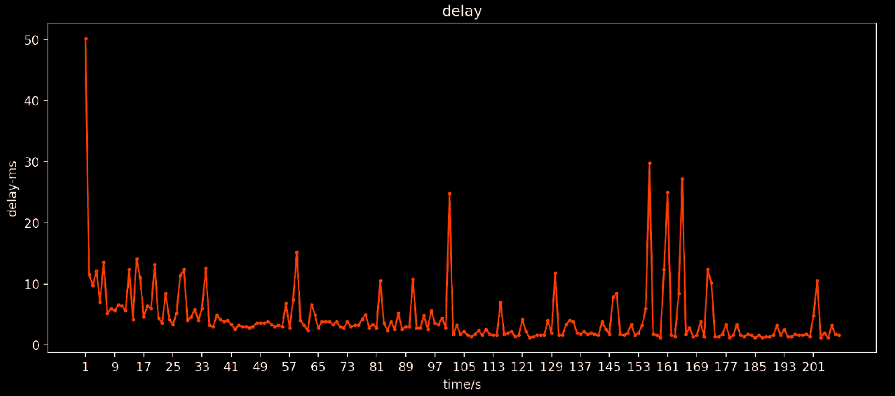

# Evaluation Diagram

*3 nodes, 0.5 Hz each, running for 100 seconds*

*8 nodes, 5 Hz each, running for 100 seconds*

*3 nodes, 0.5 Hz each, running for 100 seconds, then one node fails, and the rest continue to run for 100 seconds*

*8 nodes, 5 Hz each, running for 100 seconds, then 3 nodes fail simultaneously, and the rest continue to run for 100 seconds.*

